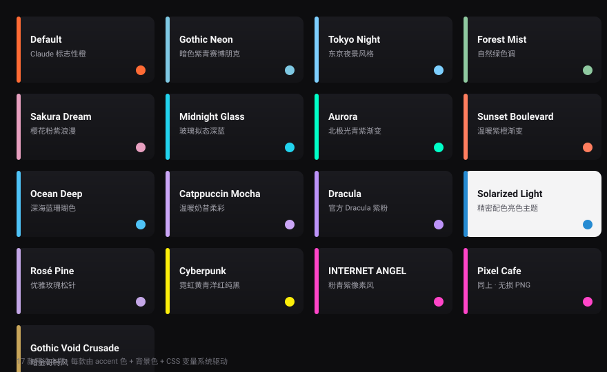
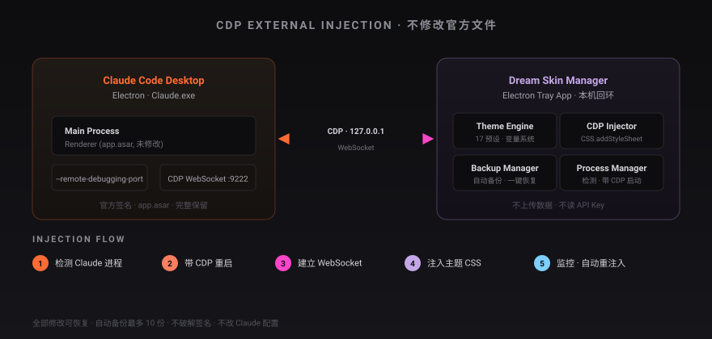

<p align="center">
  
</p>

<p align="center">
  <a href="./README.md"><strong>中文</strong></a> · English
</p>

<p align="center">
  <a href="https://github.com/TQSY114514/claude-code-dream-skin/blob/master/LICENSE"></a>
  
  
  
  
</p>

<p align="center">
  <strong>A breathing new face for Claude Code Desktop.</strong><br>
  External theme tool · Local CDP injection · Never modifies the official package
</p>

<p align="center">
  One image, one mood · Code with atmosphere
</p>

---

## What it does

Injects CSS themes into Claude Desktop **externally** via the Chrome DevTools Protocol — no binary patches, no signature breaks, no config changes.

- **CDP external injection** — opens a WebSocket via `--remote-debugging-port`, applies themes through `CSS.addStyleSheet`
- **No official files touched** — app.asar, signature, and core logic stay intact
- **CSS variable system** — 20+ custom properties drive every visual element
- **Multi-layer backgrounds** — background image + blur + parallax; ambient on home, muted on task pages
- **17 preset themes** — from Claude's signature orange to gothic gold, sakura pinks, pixel art
- **Custom imports** — `.zip` theme packs validated by Safe CSS before joining the library
- **Auto backup** — backs up before every switch, one-click restore, up to 10 snapshots
- **System tray** — runs in the background, right-click to switch, auto-reinjects on navigation
- **Safe by design** — no data uploaded, no API Key read, no Claude config altered

> Not an Anthropic product. Claude and related marks belong to their owners.

## Preset themes

<p align="center">
  
</p>

Each theme is driven by an `accent` color + background color + CSS variable system, with custom background image support.

## How it works

<p align="center">
  
</p>

1. **Detect** — scan for the running Claude Desktop process (supports both website and Microsoft Store builds)
2. **Launch** — restart Claude with `--remote-debugging-port=9222`
3. **Connect** — open a CDP WebSocket (bound to `127.0.0.1` only)
4. **Inject** — apply theme CSS via `CSS.addStyleSheet`
5. **Monitor** — auto-reinject on navigation/refresh
6. **Backup** — save original state for restore

> Microsoft Store Claude swallows CLI args due to MSIX sandboxing and needs COM activation (`store-activate.ps1`). Website builds accept args directly. See [detection order](./docs/references.md).

## Quick start

### Run from source

```bash
npm install
npm run build:assets   # compile runtime theme assets (required, or injection fails)
npm start
```

> It still launches without `build:assets` — the injector falls back to source files and compiles in memory, with a console warning. Always run it before packaging a release.

### Build installer

```bash
npm run build:win      # produces NSIS installer in dist/
```

### Usage flow

1. Launch Dream Skin Manager (tray icon appears)
2. Confirm Claude Desktop is detected on the **Settings** tab
3. Click **Restart Claude with CDP** (first run adds the CDP flag)
4. Pick a theme on the **Themes** tab and apply
5. Switch / import / restore all from the tray right-click menu

## Theme format

Each theme is a directory:

```
themes/
├── default/
│   ├── theme.json        # metadata + color config
│   └── style.css         # CSS custom properties
├── midnight-glass/
│   ├── theme.json
│   ├── style.css
│   └── background.png    # optional background image
```

`theme.json` example:

```json
{
  "name": "Midnight Glass",
  "displayName": "Midnight Glass",
  "author": "Your Name",
  "version": "1.0.0",
  "description": "Dark glassmorphism theme",
  "colors": {
    "accent": "#22d3ee",
    "bg": "#0a0e17",
    "panel": "#111827",
    "surface": "#1e293b",
    "text": "#e2e8f0",
    "muted": "#64748b"
  }
}
```

## Safety

- Never modifies the official package (app.asar)
- Never replaces official files, breaks signatures, or alters core logic
- All changes are reversible, with up to 10 automatic backups
- CDP binds only to `127.0.0.1` — don't run untrusted local programs while a theme is active
- No data uploaded, no API Key read, no Claude config or model settings changed

## Tech stack

| Component | Tech |
|-----------|------|
| Desktop framework | Electron 34 |
| Injection | Chrome DevTools Protocol |
| Styling | Vanilla CSS + CSS Custom Properties |
| Packaging | electron-builder 25 |
| Theme archives | adm-zip |

## Tests

```bash
npm test
```

## Acknowledgements

Inspired by [Codex Dream Skin](https://github.com/Fei-Away/Codex-Dream-Skin) by Fei-Away and [Codex Dream Skin (Internet Angel fork)](https://github.com/EmiyaKatuz/Codex-Dream-Skin) by EmiyaKatuz.

## License

[MIT License](./LICENSE)

---

> Not affiliated with Anthropic PBC. Claude and related marks belong to their owners.
